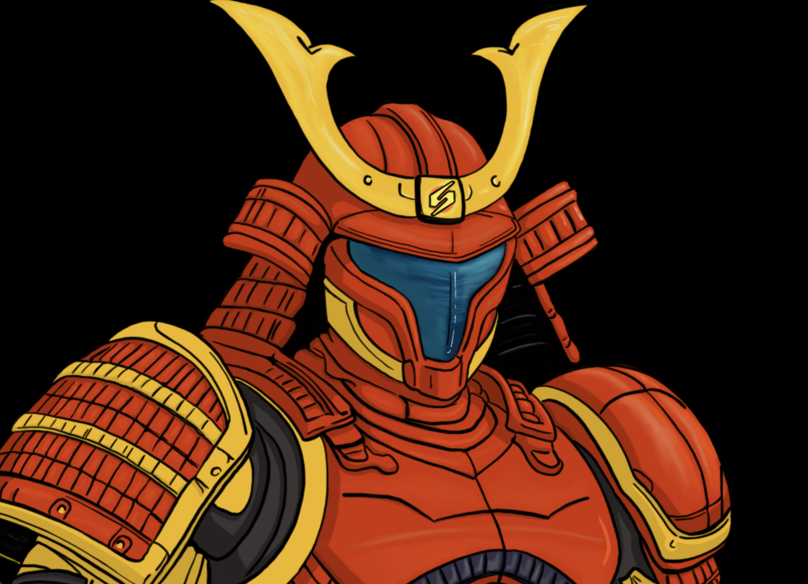
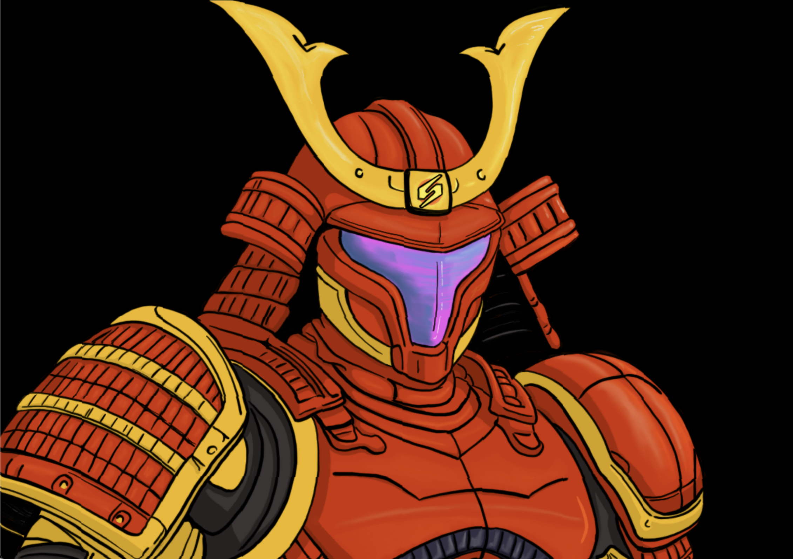
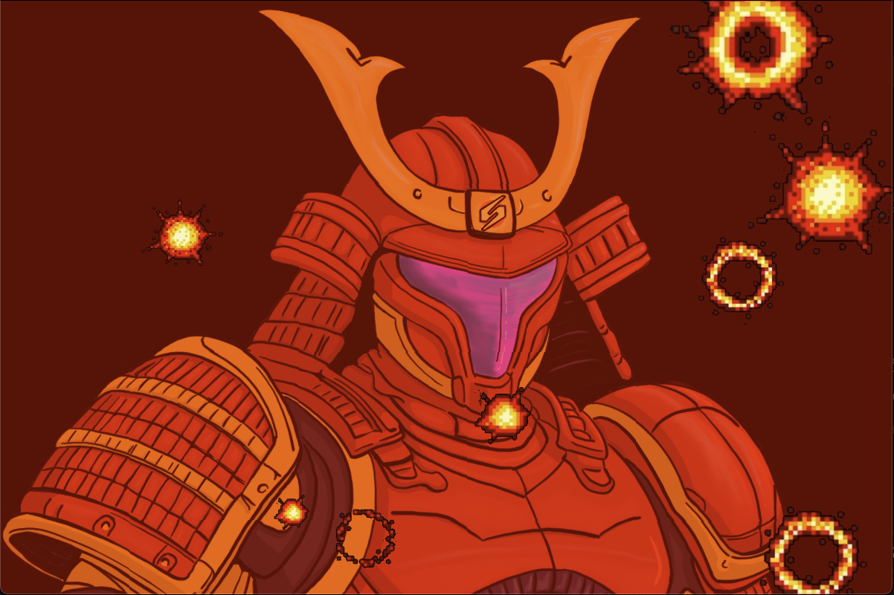
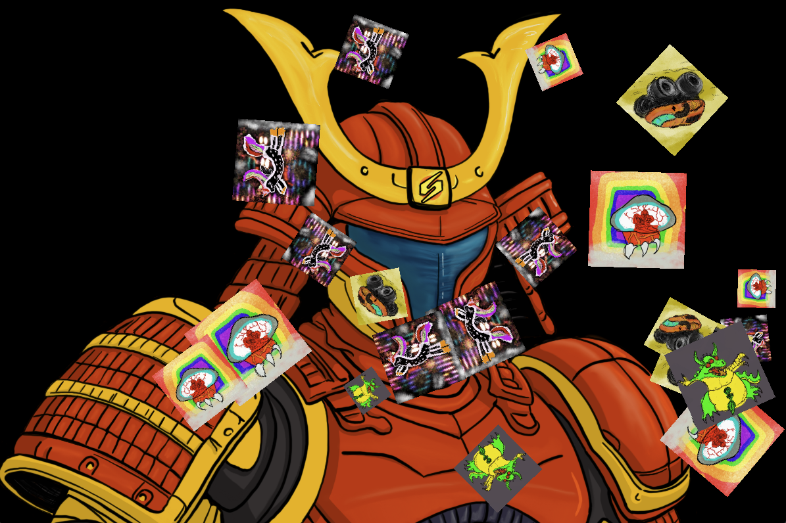
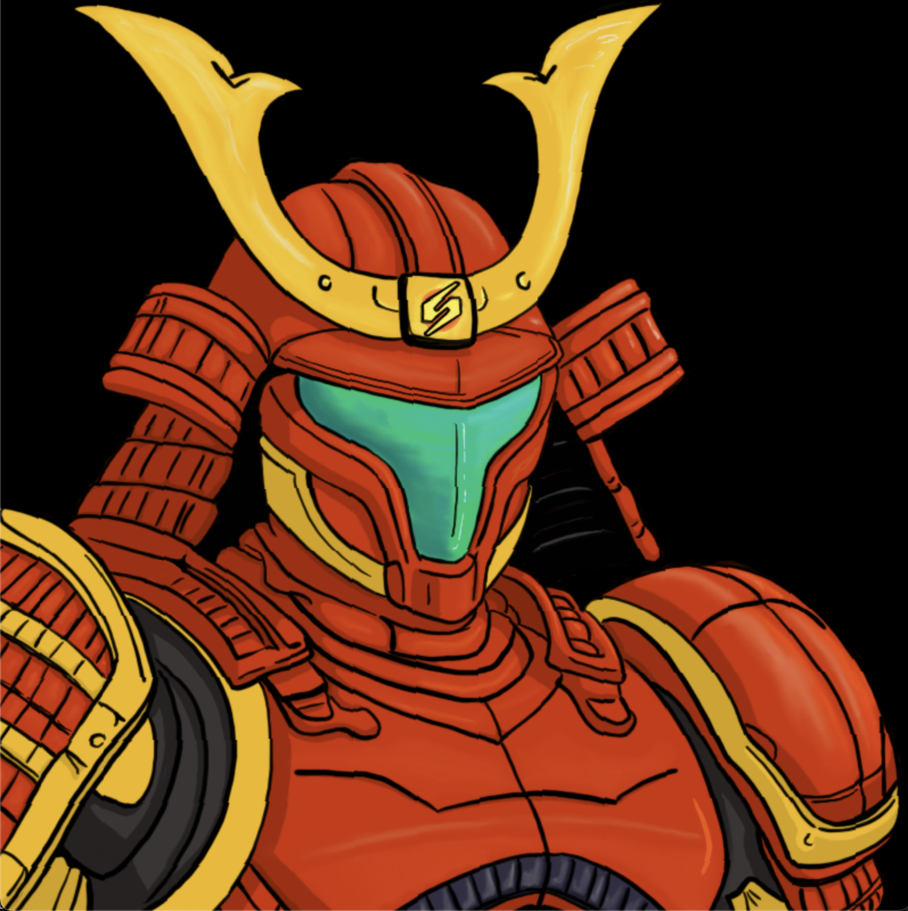

# Samurai Samus Avatar

A VTuber-style avatar application featuring the Kentroid Samurai character with voice reactivity and multiple view modes.

## Screenshots


 





**Example in action:** [Watch on YouTube](https://www.youtube.com/watch?v=bovZW-hlgkY)

## Features

- **Voice Reactivity**: Dynamic visor glow that changes color based on audio intensity
  - Idle: Deep blue
  - Low volume: Cyan
  - Medium: Green
  - High: Pink/Magenta
  - Very high: Purple
- **Multiple Zoom Levels** (Z+1 to Z+0):
  - Zoom 1 (Z+1): Full body view
  - Zoom 2-4 (Z+2-4): Mid-body progressive zooms
  - Zoom 5-9 (Z+5-9): Face/head progressive zooms (increasingly closer)
  - Zoom 10 (Z+0): Maximum close-up
- **Viewport Dimensions**:
  - Dimension 1 (D+1): 800x800 square
  - Dimension 2 (D+2): 1200x800 widescreen
  - Dimension 3 (D+3): 1920x1080 Full HD (OBS-optimized, 100px lower positioning)
- **Backgrounds** (B+1 to B+9):
  - Black, Rainbow, Samus Ship (2 variants)
  - Crateria, Brinstar, Hellway, Tourian
  - **CHAOS** - Mathematical madness background 🌀✨💫
- **Visual Effects**:
  - Effect 1 (E+1): RAGE mode (red tint + explosions)
  - Effect 2 (E+2): EMOJI PARTY (bouncing emojis)
  - Effect 3 (E+3): PSYCHEDELIC mode (8 rotating neon patterns - auto-cycles every 5 seconds)
- **Smooth Animations**: Dynamic head rocking/bobbing patterns
- **Microphone Input**: Real-time audio detection with device selection

## Installation

1. Install Python 3.8 or higher
2. Install dependencies:

```bash
pip install -r requirements.txt
```

## Usage

### Basic Usage

Run the application:

```bash
python pngtuber.py
```

### Audio Device Selection

List available audio input devices:

```bash
python pngtuber.py --list-devices
```

Use a specific audio device:

```bash
python pngtuber.py --device <index>
```

Example:
```bash
python pngtuber.py --device 3
```

### Controls

**Zoom Levels:**
- **Z + 1**: Full body zoom
- **Z + 2-4**: Mid-body progressive zooms
- **Z + 5-9**: Face progressive zooms
- **Z + 0**: Maximum close-up (zoom 10)

**Viewport:**
- **D + 1**: Square viewport (800x800)
- **D + 2**: Wide viewport (1200x800)
- **D + 3**: Full HD viewport (1920x1080, OBS-optimized)

**Backgrounds:**
- **B + 1**: Black background
- **B + 2**: Rainbow background
- **B + 3-8**: Metroid-themed backgrounds (Ship, Crateria, Brinstar, Hellway, Tourian)
- **B + 9**: CHAOS background (Mathematical madness! 🌀)

**Effects:**
- **E + 1**: Toggle RAGE effect (red tint + explosions)
- **E + 2**: Toggle EMOJI PARTY effect (bouncing emojis)
- **E + 3**: Toggle PSYCHEDELIC effect (8 auto-cycling neon patterns)
  - Patterns: Horizontal Waves, Vertical Waves, Diagonal Scan, Radial Burst, Checkerboard, Glitch Bars, Spiral, Plasma
  - Auto-cycles every 5 seconds for constant variation

**Position Fine-Tuning:**
- **Arrow Keys**: Adjust Samus + visor orb position (±5px per press)
  - Up/Down: Move vertically
  - Left/Right: Move horizontally
- **R**: Reset position to center (X=0, Y=0)
- Use this to perfectly frame your character for OBS scenes!

**Other:**
- **T**: Toggle UI text overlay
- **ESC**: Quit application

### Configuration File

The PNG-Tuber automatically saves your preferences to `~/.kentroid_samurai_avatar.json`:

**Saved Settings:**
- Viewport/dimension selection
- Zoom level
- Background choice
- Position offsets (X/Y)
- Last audio device used

**How it works:**
- Settings are saved automatically whenever you make changes
- On next launch, your preferences are restored
- CLI arguments (like `--device`) override saved config
- Delete the config file to reset to defaults

**Example config file** (see `example_config.json`):
```json
{
  "viewport": 2,
  "zoom": 1,
  "background": 1,
  "viewport_x_offset": 0,
  "viewport_y_offset": -50,
  "audio_device_index": 3
}
```

Where:
- `viewport`: 0=800x800, 1=1200x800, 2=1920x1080
- `zoom`: 0-9 (0=full body, 1-3=mid-body, 4-9=face zooms)
- `background`: 1-9 (1=black, 2=rainbow, 3-8=metroid themes, 9=chaos)
- `viewport_x_offset` / `viewport_y_offset`: Position adjustments in pixels
- `audio_device_index`: Microphone device index (null for default)

### Adjusting Settings

You can modify these settings in `pngtuber.py`:

- **Visor position**: Adjust `visor_center_offset`
- **Zoom settings**: Modify `zoom_levels` array
- **Audio sensitivity**: Change `audio_threshold`
- **Rock animation**: Adjust `max_rock_angle` and `rock_speed`
- **Glow effect**: Modify glow colors and intensity

## Building as a Mac App

You can package the PNG-Tuber as a standalone macOS `.app` bundle:

```bash
# Install py2app (already in requirements.txt)
pip install py2app

# Build the app
python setup.py py2app

# The app will be in the dist/ folder
open dist/pngtuber.app
```

See **[BUILD_APP.md](BUILD_APP.md)** for detailed instructions, troubleshooting, and advanced options.

## Use with OBS

To use this as an overlay in OBS Studio:

1. Run the PNG-Tuber application (from command line or as a Mac app)
2. In OBS, add a "Window Capture" source
3. Select the PNG-Tuber window

## Troubleshooting

**Performance issues:**
- Lower the FPS in the code (change `clock.tick(60)` to a lower value)
- Reduce the glow effect complexity
